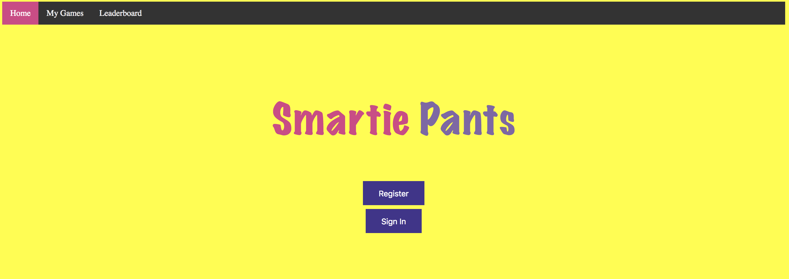
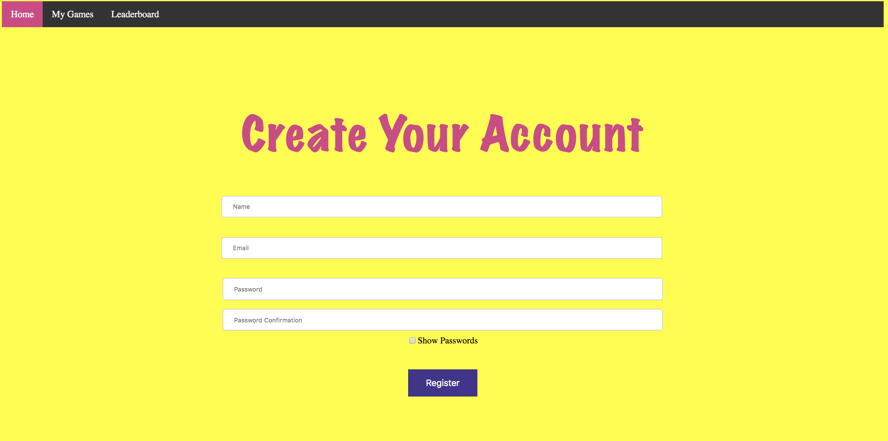
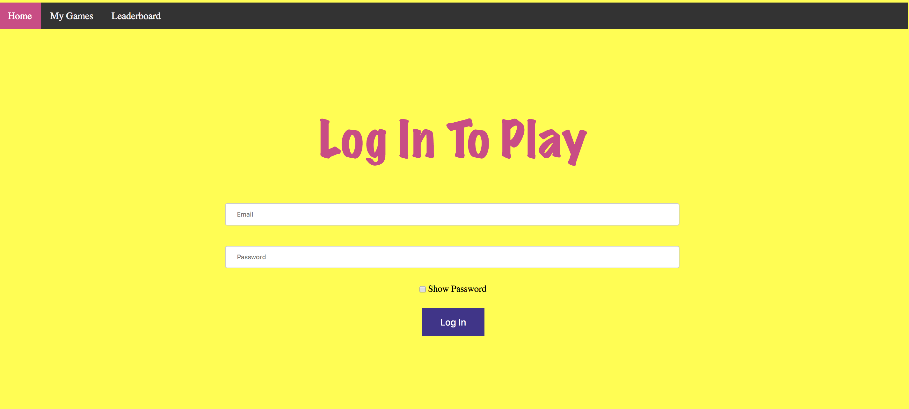
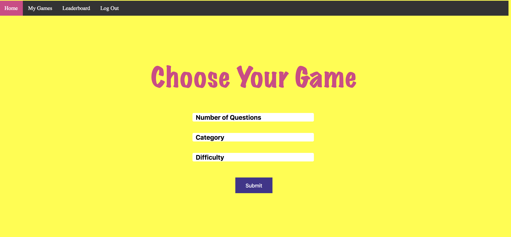
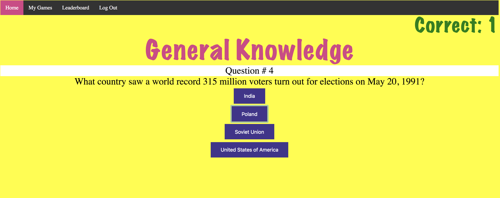
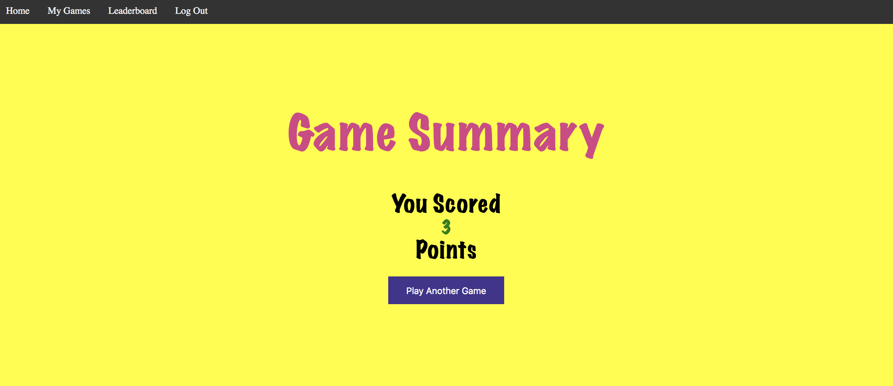
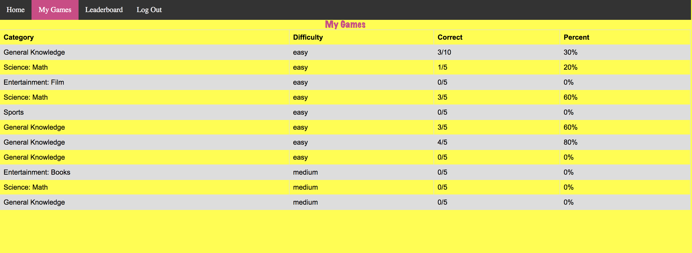
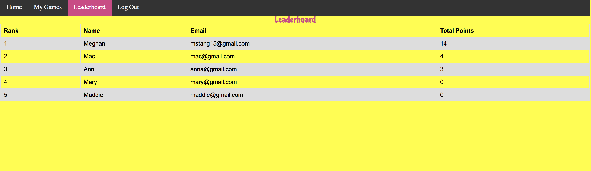

# Smartie Pants Front End
production link: https://megstang.github.io/trivia_fe/
agile board link: https://github.com/mstang15/trivia_fe/projects/1

This front end repo is written in javascript and it dogfoods the trivia_be API that I built as a Ruby on Rails API. 
You can find the backend here: https://github.com/mstang15/trivia_be

<h1>App Overview</h1>

When a user visits the app, they see a welcome screen that allows the user to either register or log in. Once logged in, a user can choose the category, number of questions, and level of difficulty. When playing the game, the user will have one chance to answer the question by selecting the button that they think is the correct answer. Users are immediately notified whether or not they got the answer correct, and there is also a count in the top right corner that will tell the user how many they have gotten correct during this round. Once the game is done, the user gets a game summary. They can either choose to play another game, checkout the leaderboard for all users, or take a look at all of their game summaries. 

Home page:

)
 
Register page:

Log In page:

Select Game page:

Play Game page:

Game Summary page:

My Game Summaries page:

Leaderboard page:

## Set Up
You can run this app locally by running the following commands:
1. git clone <paste repo link for trivia_fe>
2. cd trivia_fe
3. npm install 
4. open index.html

## Built With

* [JavaScript](https://www.javascript.com/)
* [jQuery](https://jquery.com/)

##Creator
Meghan Stang (github: @mstang15)
